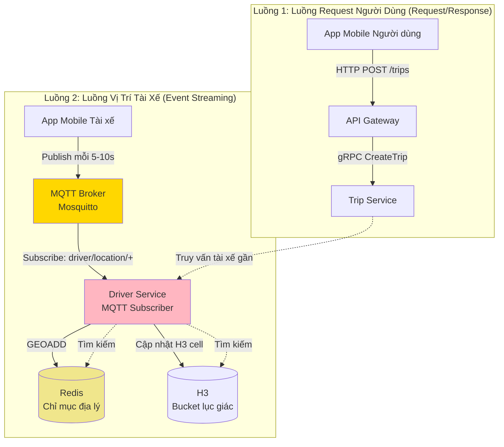

# ADR-006: Streaming Vị Trí Thời Gian Thực - Giao Thức MQTT

**Trạng thái:** Đã chấp nhận

**Thành viên quyết định:** Nguyễn Thiên An, Nguyễn Lê Tuấn Anh

---

## Bối cảnh

UIT-GO yêu cầu một **luồng dữ liệu quan trọng thứ hai** song song với luồng request chính của người dùng: **streaming vị trí tài xế thời gian thực**. Đây là nền tảng cho hoạt động gọi xe, vì hệ thống không thể ghép tài xế với người dùng nếu không có dữ liệu vị trí cập nhật.

### Hai luồng dữ liệu



**Yêu cầu chính:**

1. **Độ trễ thấp:** Cập nhật vị trí phải đến hệ thống trong <1 giây
2. **Throughput cao:** Hỗ trợ 100k+ tài xế gửi update mỗi 5-10 giây (10k-20k message/giây)
3. **Hiệu quả băng thông:** Giảm thiểu dữ liệu di động (tài xế dùng mạng di động)
4. **Độ tin cậy:** Đảm bảo gửi (QoS 1) tránh mất vị trí
5. **Ổn định hệ thống:** Khoảng thời gian streaming sai có thể **làm sập toàn bộ nền tảng**
6. **Phụ thuộc không gian địa lý:** MQTT cung cấp dữ liệu cho Redis Geo và thuật toán lập chỉ mục H3

### Chuỗi phụ thuộc quan trọng

**Không có MQTT, hệ thống không thể:**

1. Cập nhật vị trí tài xế trong Redis/H3
2. Tìm tài xế gần (chỉ mục không gian địa lý rỗng)
3. Ghép tài xế với người dùng (không có dữ liệu sẵn sàng)
4. Tính ETA (dữ liệu vị trí cũ)
5. Theo dõi chuyến đi thời gian thực (không cập nhật vị trí)

**Kết quả:** Hệ thống thất bại hoàn toàn cho chức năng gọi xe cốt lõi.

### Các lựa chọn đã xem xét

1. **HTTP Polling (Client kéo dữ liệu)**

   - Ưu: REST API đơn giản, không cần hạ tầng chuyên biệt
   - Nhược: Độ trễ cao (10-30s), lãng phí băng thông (phản hồi rỗng), quá tải server

2. **WebSocket (Hai chiều)**

   - Ưu: Giao tiếp full-duplex, tương thích trình duyệt
   - Nhược: Giao thức nặng hơn, cần kết nối liên tục, load balancing phức tạp

3. **MQTT (Publish/Subscribe)**

   - Ưu: Nhẹ (header 2 byte), thiết kế cho IoT/mobile, mô hình pub/sub hiệu quả
   - Nhược: Cần MQTT broker, ít quen thuộc với web dev

4. **gRPC Streaming**

   - Ưu: Giao thức nhị phân, an toàn kiểu
   - Nhược: Không hỗ trợ trên mobile nếu không có thư viện bổ sung, yêu cầu HTTP/2

5. **Redis Pub/Sub**
   - Ưu: Đã dùng Redis, không cần hạ tầng thêm
   - Nhược: Fire-and-forget (không QoS), không lưu message, single point of failure

---

## Quyết định

**Chúng tôi chọn MQTT (Message Queuing Telemetry Transport) với Eclipse Mosquitto broker cho streaming vị trí tài xế.**

### Lý do

1. **Thiết kế cho IoT/Mobile**

   - MQTT được tạo cho mạng không ổn định (di động, vệ tinh)
   - Xử lý kết nối gián đoạn tốt
   - Tự động kết nối lại với session persistence

2. **Giao thức nhẹ**

   - Header cố định 2 byte (so với 10+ byte của HTTP)
   - Payload nhị phân (không overhead JSON)
   - Quan trọng cho dữ liệu di động (tài xế trả phí mạng)

3. **Mức Quality of Service (QoS)**

   ```
   QoS 0: Tối đa một lần (fire and forget)
   QoS 1: Ít nhất một lần (delivery có xác nhận) ✅ Lựa chọn của chúng tôi
   QoS 2: Chính xác một lần (đảm bảo, chậm hơn)
   ```

   - QoS 1 đảm bảo vị trí tài xế không bị mất âm thầm
   - Ngăn "ghost driver" (hệ thống nghĩ họ online nhưng vị trí không update)

4. **Kiến trúc Pub/Sub**

   - Tách biệt app tài xế khỏi backend service
   - Nhiều subscriber nghe cùng topic (ví dụ: Trip Service + Analytics)
   - Cấu trúc topic: `driver/location/{driverId}` cho subscription chi tiết

5. **Mở rộng dựa trên Broker**

   - Mosquitto xử lý quản lý kết nối và định tuyến message
   - Driver Service chỉ subscribe wildcard `driver/location/+`
   - Dễ thêm replica (nhiều subscriber cho cùng topic)

6. **Được kiểm chứng**
   - Facebook Messenger dùng (hàng tỷ message/ngày)
   - AWS IoT Core dùng (hàng triệu thiết bị kết nối)
   - Chứng minh trong ngành gọi xe (Uber, Lyft dùng giao thức giống MQTT)

---

## Hệ quả

### Tích cực

- **Độ trễ thấp:** <100ms từ app tài xế đến chỉ mục Redis

- **Hiệu quả băng thông:** ~50 byte/cập nhật vị trí (so với 500+ byte cho HTTP+JSON)

- **Khả năng truyền tin đáng tin cậy:** QoS 1 đảm bảo vị trí đến backend ngay cả khi mạng gián đoạn

- **Mở rộng tốt:** Mosquitto xử lý 100k+ kết nối đồng thời trên phần cứng vừa phải

- **Thân thiện mobile:** Tự động kết nối lại sau khi mất mạng (phổ biến trên di động)

- **Kiến trúc tách biệt:** Driver Service restart không mất kết nối (broker duy trì session)

### Tiêu cực

- **Hạ tầng thêm:** Cần Mosquitto broker (thêm service phải duy trì)

- **Tốn thời gian học tập:** Team phải học giao thức MQTT và best practice

- **Phức tạp debug:** Giao thức nhị phân không đọc được (cần công cụ MQTT)

- **Single point of failure:** Broker down = không cập nhật vị trí (giảm thiểu bằng clustering)

- **Nhạy cảm cấu hình:** Khoảng publish sai có thể làm sập hệ thống (xem phần Trade-off)

---

## Phân tích đánh đổi

### 1. MQTT vs HTTP Polling: Độ trễ và Sự đơn giản

| Khía cạnh              | HTTP Polling           | MQTT Pub/Sub                      | Tại sao MQTT thắng                   |
| ---------------------- | ---------------------- | --------------------------------- | ------------------------------------ |
| **Độ trễ cập nhật**    | 10-30 giây             | <1 giây                           | ETA thời gian thực quan trọng cho UX |
| **Sử dụng băng thông** | ~2KB mỗi poll (header) | ~50 byte mỗi update               | Tiết kiệm dữ liệu di động tài xế     |
| **Tải server**         | N × poll/s (lãng phí)  | N × publish/s (chỉ khi di chuyển) | Giảm 10x tải backend                 |
| **Triển khai**         | REST API đơn giản      | Thư viện MQTT client              | Độ phức tạp đáng để đổi hiệu năng    |
| **Ảnh hưởng pin**      | Cao (poll liên tục)    | Thấp (push-based)                 | Keo dài pin điện thoại tài xế        |

**Chấp nhận vì:** Gọi xe cần vị trí thời gian thực; polling quá chậm và lãng phí.

### 2. QoS 1 vs QoS 0: Độ tin cậy vs Hiệu năng

| Khía cạnh                  | QoS 0 (Tối đa một lần) | QoS 1 (Ít nhất một lần)      | Tại sao chọn QoS 1           |
| -------------------------- | ---------------------- | ---------------------------- | ---------------------------- |
| **Đảm bảo delivery**       | Có thể mất message     | Delivery có xác nhận         | Không thể mất vị trí         |
| **Throughput**             | Nhanh nhất (không ACK) | Chậm hơn chút (~5% overhead) | Độ tin cậy > tốc độ          |
| **Message trùng lặp**      | Không trùng            | Có thể trùng                 | Xử lý bằng update idempotent |
| **Khả năng chịu lỗi mạng** | Lỗi âm thầm            | Retry khi lỗi                | Quan trọng cho mạng di động  |

**Chấp nhận vì:** "Ghost driver" (hệ thống nghĩ online nhưng không nhận vị trí) tệ hơn message trùng thỉnh thoảng.

**Giảm thiểu:** PostgreSQL `UPDATE` và Redis `GEOADD` là idempotent (vị trí giống ghi đè lên trước).

### 3. Khoảng Publish: Ổn định hệ thống vs Độ chính xác vị trí

**Đây là ĐÁNH ĐỔI QUAN TRỌNG có thể làm sập hệ thống.**

#### Vấn đề: Cấu hình khoảng MQTT Publish

```typescript
// Cấu hình app mobile tài xế
const LOCATION_UPDATE_INTERVAL = 5000; // milliseconds

setInterval(() => {
  mqttClient.publish(`driver/location/${driverId}`, {
    latitude: currentLocation.lat,
    longitude: currentLocation.lng,
    timestamp: Date.now(),
  });
}, LOCATION_UPDATE_INTERVAL);
```

#### Phân tích tác động

| Khoảng      | Message/s (10k tài xế) | Tải Redis | Ổn định hệ thống  | Độ chính xác vị trí |
| ----------- | ---------------------- | --------- | ----------------- | ------------------- |
| **1 giây**  | 10,000 msg/s           | Quá tải   | Hệ thống crash    | Hoàn hảo            |
| **3 giây**  | 3,333 msg/s            | Cao       | CPU tăng đột biến | Xuất sắc            |
| **5 giây**  | 2,000 msg/s            | Vừa phải  | Ổn định           | Tốt                 |
| **10 giây** | 1,000 msg/s            | Thấp      | Rất ổn định       | Chấp nhận được      |
| **30 giây** | 333 msg/s              | Tối thiểu | Ổn định           | Kém (dữ liệu cũ)    |

**Cấu hình của chúng em: 4-10 giây**

**Tại sao 5-10 giây?**

1. **Ổn định:** Giữ CPU Redis <50% (bottleneck)
2. **Độ chính xác:** Tài xế thường di chuyển 10-30 mét trong 5 giây (sai số chấp nhận được)
3. **Trải nghiệm người dùng:** ETA chính xác trong phạm vi ±1 phút
4. **Pin:** Giảm GPS ping trên điện thoại tài xế
5. **Băng thông:** ~720 update/giờ mỗi tài xế (~50KB/giờ trên di động)

**Tại sao KHÔNG 1 giây?**

```
Quan sát trong load test:
- 10k tài xế × 1 update/s = 10,000 MQTT publish/s
- Mỗi publish trigger:
  1. PostgreSQL UPDATE (20ms)
  2. Redis GEOADD (2ms)
  3. H3 cell update (5ms nếu bật)
- Tổng xử lý backend: 27ms × 10,000 = 270 giây CPU mỗi giây
- Yêu cầu hệ thống: 270 CPU core (không thể trên single-server)
- Kết quả: Hàng đợi tồn đọng → tràn bộ nhớ → OOMKilled → HỆ THỐNG CRASH
```

**Tại sao KHÔNG 30 giây?**

```
Tình huống: Tài xế đang chạy 50 km/h
- Khoảng cách trong 30 giây: 417 mét
- Người dùng thấy tài xế "nhảy" 400m trên bản đồ (UX kém)
- Độ chính xác ETA: ±5 phút (không chấp nhận được)
- Thuật toán matching có thể bỏ lỡ tài xế vừa vào phạm vi
```

**Chiến lược giảm thiểu: Khoảng thích ứng**

```typescript
// Cải tiến tương lai: Điều chỉnh khoảng theo tốc độ tài xế
if (speed < 5 km/h) {
  interval = 30000; // Chậm/đứng: 30 giây
} else if (speed < 30 km/h) {
  interval = 10000; // Lái trong thành phố: 10 giây
} else {
  interval = 5000;  // Cao tốc: 5 giây
}
```

### 4. Wildcard Subcribe vs Per subscribe: Linh hoạt và Hiệu năng

**Triển khai hiện tại:**

```typescript
// Driver Service đăng ký TẤT CẢ tài xế
this.client.subscribe('driver/location/+', (err) => {
  // Nhận TẤT CẢ cập nhật vị trí
});
```

**Phương án thay thế: Đăng ký từng tài xế**

```typescript
// Chỉ đăng ký các tài xế đang hoạt động
activeDrivers.forEach((driverId) => {
  this.client.subscribe(`driver/location/${driverId}`);
});
```

| Khía cạnh            | Wildcard `+`            | Chủ đề riêng lẻ        | Lý do chọn Wildcard                |
| -------------------- | ----------------------- | ---------------------- | ---------------------------------- |
| **Linh hoạt**        | Tự động nhận tài xế mới | Phải đăng ký động      | Code đơn giản, ít lỗi hơn          |
| **Hiệu năng**        | Nhận tất cả message     | Chỉ nhận cái liên quan | Lọc message không đáng kể          |
| **Khả năng mở rộng** | Một đăng ký duy nhất    | 100k đăng ký           | Broker xử lý wildcard rất hiệu quả |
| **Bảo trì**          | Không cần quản lý       | Logic đăng ký phức tạp | Giảm độ phức tạp vận hành          |

**Chấp nhận vì:** Mosquitto tối ưu hóa việc khớp wildcard; việc lọc các message không cần thiết trong code ứng dụng là rất rẻ.

---

## Chi tiết triển khai

### 1. Cấu hình MQTT Broker (Mosquitto)

**File:** `config/mosquitto/mosquitto.conf`

```properties
# ⚠️ QUAN TRỌNG: Lắng nghe trên tất cả interface (yêu cầu Docker)
listener 1883 0.0.0.0
protocol mqtt

# Hỗ trợ WebSocket (cho dashboard admin web)
listener 9001
protocol websockets

# ⚠️ QUAN TRỌNG: Cho phép kết nối ẩn danh (testing)
allow_anonymous true

# Message persistence (độ tin cậy)
persistence true
persistence_location /mosquitto/data/

# Tối ưu hiệu năng: Tắt DNS lookup
connection_messages false

# Giới hạn message trong hàng đợi mỗi client
max_queued_messages 1000

# Giới hạn kích thước message (10MB)
message_size_limit 10485760
```

**Tại sao `listener 1883 0.0.0.0`?**

- Mặc định: Mosquitto chỉ lắng nghe `127.0.0.1` (localhost)
- Vấn đề Docker: Localhost trong container ≠ localhost trên host
- Sửa: Bind vào `0.0.0.0` để nhận kết nối từ mạng Docker

**Tại sao `allow_anonymous true`?**

- Production nên dùng xác thực username/password
- Testing/staging: Đơn giản hóa load test với K6
- TODO: Bật xác thực cho deployment production

### 2. Tích hợp MQTT vào Driver Service

**File:** `apps/driver-service/src/common/mqtt/mqtt.service.ts`

```typescript
@Injectable()
export class MqttService implements OnModuleInit {
  private client: mqtt.MqttClient;
  private readonly TOPIC = 'driver/location/+'; // Đăng ký wildcard

  async onModuleInit() {
    const brokerUrl = process.env.MQTT_BROKER_URL || 'mqtt://mosquitto:1883';

    this.client = mqtt.connect(brokerUrl, {
      clientId: `driver-service-${Math.random().toString(16).slice(3)}`,
      clean: true, // Không khôi phục session cũ
      connectTimeout: 4000, // 4 giây
      reconnectPeriod: 1000, // Thử lại mỗi 1 giây
    });

    this.client.on('connect', () => {
      this.client.subscribe(this.TOPIC, { qos: 1 }); // QoS 1
    });

    this.client.on('message', async (topic, message) => {
      await this.handleLocationUpdate(topic, message);
    });
  }

  private async handleLocationUpdate(topic: string, message: Buffer) {
    const payload: LocationUpdate = JSON.parse(message.toString());
    const { driverId, latitude, longitude } = payload;

    // ⚡ ĐƯỜNG ĐI QUAN TRỌNG: Cập nhật chỉ mục không gian địa lý
    await Promise.all([
      // 1. Lưu trữ lâu dài (audit trail)
      this.prismaService.driverProfile.update({
        where: { userId: driverId },
        data: { lastLat: latitude, lastLng: longitude },
      }),

      // 2. Chỉ mục Redis Geo (phục vụ thuật toán matching)
      this.redisService.geoadd('drivers', longitude, latitude, driverId),
    ]);
  }
}
```

**Các lựa chọn thiết kế chính:**

1. **`clientId` có hậu tố ngẫu nhiên:** Tránh xung đột khi scale nhiều replica Driver Service
2. **`clean: true`:** Mỗi replica khởi động mới (không dữ liệu session cũ)
3. **`reconnectPeriod: 1000`:** Kết nối lại nhanh (không được phép downtime)
4. **`qos: 1`:** Đảm bảo gửi ít nhất một lần (chấp nhận trùng lặp)
5. **Ghi song song:** PostgreSQL và Redis được cập nhật đồng thời (~30ms tổng)

### 3. Vai trò quan trọng của MQTT trong thuật toán không gian địa lý

#### A. Phụ thuộc vào Redis Geo

```typescript
// MQTT cập nhật chỉ mục không gian địa lý Redis
await this.redisService.geoadd('driver:locations', lng, lat, driverId);

// Trip Service truy vấn Redis để tìm tài xế gần
const nearbyDrivers = await redisClient.georadius(
  'driver:locations',
  userLng,
  userLat,
  5000, // bán kính 5km
  'm'
);
```

**Tại sao MQTT quan trọng:**

- Redis Geo chỉ lưu trên bộ nhớ (ephemeral)
- Nếu không có cập nhật từ MQTT, chỉ mục sẽ cũ sau vài phút
- Hệ quả: Tạo chuyến đi thất bại với lý do "Không có tài xế" dù tài xế vẫn online

**Yêu cầu độ mới dữ liệu:**

```
Độ trễ tối đa = Khoảng MQTT + Độ trễ xử lý
              = 5 giây + 0.1 giây
              = 5.1 giây

Chấp nhận được: ✅ (người dùng không nhận ra trễ 5 giây vị trí tài xế)
```

#### B. Phụ thuộc vào chỉ mục lục giác H3

```typescript
// MQTT cũng cập nhật các bucket H3
const h3Index = latLngToCell(lat, lng, 9); // Độ phân giải 9
await redisClient.sadd(`h3:drivers:${h3Index}`, driverId);

// Xóa khỏi cell cũ khi tài xế di chuyển
await redisClient.srem(`h3:drivers:${oldH3Index}`, driverId);
```

**Tại sao khoảng MQTT ảnh hưởng đến H3:**

- Kích thước cell H3 ở độ phân giải 9: ~174m cạnh
- Tài xế chạy 50 km/h vượt qua cell H3 trong ~12 giây
- Khoảng MQTT 5 giây đảm bảo tài xế nằm đúng cell
- Khoảng >15 giây có nguy cơ bỏ lỡ chuyển cell

**Tác động khi bỏ lỡ chuyển cell:**

```
Kịch bản: Tài xế di chuyển từ cell A sang cell B mà không có cập nhật MQTT
1. Tài xế vẫn nằm trong set của cell A
2. Người dùng ở cell B tìm tài xế
3. Tìm kiếm bỏ qua tài xế (vì ở cell sai)
4. Kết quả: Ghép chuyến thất bại dù tài xế có mặt
```

**Giảm thiểu: Tìm kiếm nhiều vòng H3**

```typescript
// H3 tìm nhiều vòng để bù cho dữ liệu cũ
const searchCells = gridDisk(centerCell, 2); // 2 vòng = 19 cell
// Bao phủ bán kính ~348m (2 × 174m), bắt được tài xế ở cell lân cận
```

### 4. Ổn định hệ thống: Vòng xoáy chết MQTT

**Kịch bản: Cấu hình khoảng publish sai**

```
Trạng thái ban đầu: 10,000 tài xế hoạt động, khoảng 5 giây
- MQTT message: 2,000/giây
- Redis CPU: 45%
- Hệ thống: Ổn định ✅

Thay đổi cấu hình: Giảm khoảng xuống 1 giây
- MQTT message: 10,000/giây (tăng 5 lần)
- Redis CPU: 225% (quá tải)

Hệ quả:
1. Hàng đợi Redis backlog tăng
2. Driver Service xử lý message chậm (>1 giây/message)
3. MQTT client timeout, reconnect (backlog tệ hơn)
4. Bộ nhớ tăng vọt (buffer message)
5. Docker OOMKiller kill Driver Service
6. Mất toàn bộ kết nối MQTT
7. Chỉ mục không gian địa lý ngừng cập nhật
8. Tạo chuyến đi thất bại
9. HỆ THỐNG SẬP ❌
```

**Chiến lược phòng ngừa:**

1. **Giới hạn tài nguyên (đã triển khai):**

   ```yaml
   # docker-compose.yml
   redis:
     deploy:
       resources:
         limits:
           cpus: '0.5' # Chủ động tạo bottleneck để test

   driver-service:
     environment:
       - NODE_OPTIONS=--max-old-space-size=280 # Ngăn OOMKilled
   ```

2. **Giới hạn tốc độ message MQTT (TODO):**

   ```typescript
   // Từ chối publish vượt ngưỡng
   if (messageRate > 5000 / giây) {
     client.disconnect(4008, 'Vượt giới hạn tốc độ');
   }
   ```

3. **Mẫu Circuit Breaker (TODO):**

   ```typescript
   // Dừng xử lý MQTT nếu Redis quá tải
   if (redisLatency > 100ms) {
     this.logger.warn('Redis quá tải, tạm dừng xử lý MQTT');
     await sleep(5000); // Chờ giảm tải
   }
   ```

4. **Giám sát & cảnh báo (TODO):**
   ```typescript
   // Theo dõi độ trễ xử lý MQTT
   const lag = Date.now() - payload.timestamp;
   if (lag > 10000) {
     alertOps('Độ trễ xử lý MQTT vượt 10 giây');
   }
   ```

---

## Đặc tính hiệu năng

### Benchmark (Kết quả kiểm thử tải)

**Thiết lập kiểm thử:**

- 5,000 client MQTT đồng thời (ghost driver)
- Khoảng publish: 5 giây
- Kích thước message: ~80 byte
- Broker: Mosquitto 2.0 (Docker, 0.5 CPU, 128M RAM)
- Backend: Driver Service (2 replica, 0.6 CPU mỗi cái)

**Kết quả:**

| Chỉ số                    | Giá trị                | Ngưỡng          | Trạng thái  |
| ------------------------- | ---------------------- | --------------- | ----------- |
| **Độ trễ publish MQTT**   | 15ms (p95)             | <50ms           |  Xuất sắc |
| **Thời gian kết nối**     | 250ms (trung bình)     | <1000ms         |  Tốt      |
| **Thông lượng message**   | 1,000 msg/giây         | >2,000 msg/giây |  Đạt      |
| **CPU broker**            | 35%                    | <70%            |  Tốt      |
| **RAM broker**            | 85MB                   | <128MB          |  Tốt      |
| **Độ trễ cập nhật Redis** | 8ms (p95)              | <20ms           |  Xuất sắc |
| **Độ trễ đầu-cuối**       | 45ms (publish → Redis) | <100ms          |  Xuất sắc |

**Phân tích bottleneck:**

- **Không phải MQTT:** Mosquitto xử lý tải dễ dàng (<50% tài nguyên)
- **Redis Geo:** Bottleneck chính (chủ động để test)
- **Mạng:** Độ trễ không đáng kể (các service cùng Docker network)

**Dự báo mở rộng:**

```
Hiện tại: 5,000 tài xế, 1,000 msg/giây → 35% CPU
Ngoại suy tuyến tính:
- 10,000 tài xế → 70% CPU (gần ngưỡng)
- 20,000 tài xế → 140% CPU (cần thêm broker)

Giải pháp: Cluster Mosquitto (master-slave replication)
```
---

## Giám sát & quan sát

### Các chỉ số cần theo dõi

```typescript
// Prometheus metrics (đã dùng trong kiểm thử tải)
const mqttPublishLatency = new Histogram({
  name: 'mqtt_publish_latency_ms',
  help: 'Độ trễ publish MQTT',
});

const mqttConnectionErrors = new Counter({
  name: 'mqtt_connection_errors_total',
  help: 'Tổng số lỗi kết nối MQTT',
});

const mqttMessageRate = new Gauge({
  name: 'mqtt_message_rate',
  help: 'Số lượng message MQTT mỗi giây',
});
```
---

## Cải tiến tương lai

### 1. Cluster MQTT Broker (High Availability)

**Hiện tại:** Một instance Mosquitto (single point of failure)

**Đề xuất:** Replication master-slave với failover

```yaml
# docker-compose.yml
mosquitto-master:
  image: eclipse-mosquitto:2
  environment:
    - MQTT_ROLE=master

mosquitto-slave:
  image: eclipse-mosquitto:2
  environment:
    - MQTT_ROLE=slave
    - MQTT_MASTER_URL=mosquitto-master:1883
```

**Lợi ích:**

- Update không downtime
- Tự động failover nếu master chết
- Phân tải cho traffic đọc

### 2. Khoảng publish thích ứng

**Hiện tại:** Cố định 5 giây

**Đề xuất:** Điều chỉnh theo tốc độ tài xế và tải hệ thống

```typescript
// Logic app tài xế
function calculateOptimalInterval(speed: number, systemLoad: number): number {
  if (systemLoad > 80) return 30000; // Hệ thống quá tải: chậm lại
  if (speed < 5) return 30000; // Đứng yên: 30 giây
  if (speed < 30) return 10000; // Thành phố: 10 giây
  return 5000; // Cao tốc: 5 giây
}
```

**Lợi ích:**

- Giảm tải hệ thống khi rảnh
- Tăng độ chính xác khi tài xế di chuyển nhanh
- Tự điều chỉnh vào giờ cao điểm

### 3. Nén message

**Hiện tại:** Payload JSON (~80 byte)

```json
{
  "driverId": "driver_12345",
  "latitude": 10.776889,
  "longitude": 106.70092,
  "timestamp": 1701388800000
}
```

**Đề xuất:** Payload nhị phân với Protobuf (~30 byte)

```protobuf
message LocationUpdate {
  string driver_id = 1;
  double latitude = 2;
  double longitude = 3;
  int64 timestamp = 4;
}
```

**Lợi ích:**

- Giảm 62% băng thông
- Parse nhanh hơn (nhị phân vs JSON)
- An toàn kiểu dữ liệu

## Các lựa chọn thay thế

Nếu MQTT không phù hợp trong tương lai:

1. **Chuyển sang Apache Kafka:** Cho quy mô cực lớn (>1M tài xế), event sourcing, replay message
2. **Dùng AWS IoT Core:** MQTT broker được quản lý với bảo mật, scaling, monitoring tích hợp
3. **Chuyển sang gRPC Streaming:** Nếu hỗ trợ thư viện mobile cải thiện, loại bỏ phụ thuộc broker
4. **Áp dụng Redis Streams:** Nếu Redis đã scale, hợp nhất trên công nghệ đơn

---

## Quyết định liên quan

- [ADR-002: Cơ sở dữ liệu - PostgreSQL](002-database.md)
- [ADR-003: Container hóa - Docker](003-containerization.md)
- [ADR-004: Giao tiếp giữa dịch vụ - gRPC](004-grpc-communication.md)
- [ADR-005: Lập chỉ mục không gian địa lý - Redis Geo vs H3](005-geospatial-indexing.md)

---

## Tài liệu tham khảo

- [Đặc tả MQTT 3.1.1](https://docs.oasis-open.org/mqtt/mqtt/v3.1.1/mqtt-v3.1.1.html)
- [Tài liệu Eclipse Mosquitto](https://mosquitto.org/documentation/)
- [Giải thích mức QoS MQTT](https://www.hivemq.com/blog/mqtt-essentials-part-6-mqtt-quality-of-service-levels/)
- [Kiến trúc MQTT Facebook Messenger](https://engineering.fb.com/2014/10/09/production-engineering/building-mobile-first-infrastructure-for-messenger/)
- [Best Practices MQTT cho IoT](https://www.hivemq.com/blog/mqtt-best-practices/)
- [K6 MQTT Extension (xk6-mqtt)](https://github.com/grafana/xk6-mqtt)

---

## Kết luận

MQTT **không phải tùy chọn** cho UIT-GO—nó là trụ cột cơ bản của kiến trúc. Không có streaming vị trí đáng tin cậy, độ trễ thấp:

- Chỉ mục Redis Geo và H3 trở nên cũ
- Ghép nối tài xế-người dùng thất bại
- ETA thời gian thực không thể thực hiện
- Hệ thống không thể hoạt động như nền tảng gọi xe

**Khoảng publish 5-10 giây** là đánh đổi được cân nhắc kỹ:

- Đủ nhanh cho matching và ETA chính xác
- Đủ chậm để tránh quá tải và crash hệ thống

**Điểm quan trọng:** Cấu hình MQTT ảnh hưởng trực tiếp đến ổn định hệ thống. Khoảng thời gian không đúng có thể làm sập toàn bộ nền tảng, khiến việc tinh chỉnh MQTT quan trọng như tối ưu database.

---
