# Kiến Trúc Hệ Thống UIT-GO

Tài liệu này cung cấp cái nhìn tổng quan toàn diện về kiến trúc nền tảng gọi xe UIT-GO, bao gồm ngữ cảnh hệ thống, phân rã module, luồng dữ liệu và các mẫu thiết kế.

---

## Mục Lục

1. [Ngữ Cảnh Hệ Thống](#ngữ-cảnh-hệ-thống)
2. [Kiến Trúc Tổng Quan](#kiến-trúc-tổng-quan)
3. [Phân Rã Module](#phân-rã-module)
4. [Luồng Dữ Liệu](#luồng-dữ-liệu)
5. [Công Nghệ Sử Dụng](#công-nghệ-sử-dụng)
6. [Mẫu Giao Tiếp](#mẫu-giao-tiếp)
7. [Lược Đồ Cơ Sở Dữ Liệu](#lược-đồ-cơ-sở-dữ-liệu)
8. [Kiến Trúc Triển Khai](#kiến-trúc-triển-khai)

---

## Ngữ Cảnh Hệ Thống

### Tổng Quan

UIT-GO là một nền tảng gọi xe dựa trên kiến trúc microservices, kết nối người dùng với tài xế theo thời gian thực. Hệ thống xử lý các yêu cầu chuyến đi, ghép nối tài xế sử dụng thuật toán không gian địa lý và quản lý vòng đời chuyến đi.

### Sơ Đồ Ngữ Cảnh Hệ Thống


**Các Tương Tác Bên Ngoài Chính:**

- **Ứng Dụng Di Động (Người Dùng & Tài Xế):** Khách hàng chính sử dụng REST APIs
- **Bảng Quản Trị:** Giao diện quản lý cho vận hành và giám sát
- **Dịch Vụ Clerk:** Xử lý xác thực và quản lý danh tính người dùng

---

## Kiến Trúc Tổng Quan

### Kiến Trúc Microservices


### Nguyên Tắc Kiến Trúc

1. **Độc Lập Dịch Vụ:** Mỗi microservice có cơ sở dữ liệu riêng (mẫu Database per Service)
2. **Chuyển Đổi Giao Thức:** API Gateway chuyển đổi HTTP/REST sang gRPC cho giao tiếp nội bộ
3. **Tối Ưu Không Gian Địa Lý:** Redis được sử dụng cho các truy vấn vị trí hiệu năng cao
4. **Giao Tiếp Thời Gian Thực:** MQTT broker cho việc truyền phát vị trí tài xế
5. **An Toàn Kiểu Dữ Liệu:** Định nghĩa kiểu dữ liệu được chia sẻ qua thư viện Nx monorepo

---

## Phân Rã Module

### Cấu Trúc Module API Gateway


### Cấu Trúc Module Driver Service (Phức Tạp Nhất)


**Các Thành Phần Chính của Driver Service:**

1. **Driver Controller:** Xử lý các yêu cầu gRPC đến
2. **Driver Service:** Logic nghiệp vụ cốt lõi cho quản lý tài xế
3. **Location Service:** Triển khai các thuật toán tìm kiếm không gian địa lý
   - Redis Geo (mặc định): Lệnh `GEOADD`, `GEORADIUS`
   - H3 Hexagonal Indexing (tùy chọn): Thư viện H3 của Uber cho việc đánh chỉ mục không gian hiệu quả
4. **Redis Service:** Wrapper cho các thao tác không gian địa lý của Redis
5. **MQTT Service:** Xuất bản/đăng ký cập nhật vị trí tài xế
6. **H3 Module:** Chiến lược đánh chỉ mục không gian địa lý thay thế

### Cấu Trúc Module User Service


### Cấu Trúc Module Trip Service


---

## Luồng Dữ Liệu

### Luồng Tạo Chuyến Đi (End-to-End)


**Các Bước Chính:**

1. Client gửi yêu cầu HTTP tới API Gateway
2. Gateway xác thực và chuyển tiếp qua gRPC
3. Trip Service điều phối luồng bằng cách gọi các dịch vụ khác
4. Driver Service sử dụng Redis cho tìm kiếm không gian địa lý nhanh
5. Bản ghi chuyến đi được tạo trong PostgreSQL
6. Tài xế được chỉ định và trạng thái được cập nhật
7. Phản hồi được gửi lại qua Gateway tới client

### Luồng Cập Nhật Vị Trí Tài Xế


---

## Công Nghệ Sử Dụng

### Framework Backend

| Công nghệ      | Phiên bản | Mục đích                                          |
| -------------- | --------- | ------------------------------------------------- |
| **NestJS**     | v11.x     | Framework microservices với DI và tính module hóa |
| **TypeScript** | v5.9      | Ngôn ngữ an toàn kiểu cho tất cả các dịch vụ      |
| **Node.js**    | v18+      | Môi trường thời gian chạy                         |

### Giao Tiếp & Giao Thức

| Công nghệ            | Mục đích                                         |
| -------------------- | ------------------------------------------------ |
| **gRPC**             | RPC hiệu năng cao cho giao tiếp giữa các dịch vụ |
| **Protocol Buffers** | Chuỗi hóa nhị phân hiệu quả                      |
| **REST/HTTP**        | API hướng khách hàng (API Gateway)               |
| **MQTT**             | Pub/sub nhẹ cho cập nhật thời gian thực          |

### Lưu Trữ Dữ Liệu

| Công nghệ      | Mục đích                                             |
| -------------- | ---------------------------------------------------- |
| **PostgreSQL** | Cơ sở dữ liệu quan hệ chính (một cho mỗi dịch vụ)    |
| **Prisma ORM** | Client cơ sở dữ liệu và migration an toàn kiểu       |
| **Redis**      | Caching + Đánh chỉ mục không gian địa lý (GEORADIUS) |

### Hạ Tầng

| Công nghệ          | Mục đích                             |
| ------------------ | ------------------------------------ |
| **Docker**         | Container hóa tất cả các dịch vụ     |
| **Docker Compose** | Điều phối và phát triển cục bộ       |
| **Nx**             | Quản lý monorepo và tối ưu hóa build |

### Xác Thực & Bảo Mật

| Công nghệ             | Mục đích                           |
| --------------------- | ---------------------------------- |
| **Clerk**             | Nhà cung cấp xác thực (JWT tokens) |
| **class-validator**   | Xác thực yêu cầu                   |
| **class-transformer** | Chuyển đổi DTO                     |

### Xử Lý Không Gian Địa Lý

| Công nghệ     | Mục đích                                            |
| ------------- | --------------------------------------------------- |
| **Redis Geo** | Truy vấn không gian địa lý mặc định (GEORADIUS)     |
| **H3-js**     | Đánh chễ mục không gian lục giác tùy chọn (Uber H3) |

---

## Mẫu Giao Tiếp

### 1. Mẫu API Gateway

**Mục đích:** Điểm vào duy nhất cho tất cả các yêu cầu từ client, xử lý chuyển đổi giao thức (HTTP → gRPC).

**Triển khai:**

```typescript
// API Gateway forwards HTTP to gRPC
@Post('trips')
async createTrip(@Body() dto: CreateTripDto) {
  return this.tripGrpcClient.createTrip(dto); // gRPC call
}
```

### 2. Giao Tiếp Dịch Vụ Với Dịch Vụ (gRPC)

**Mục đích:** Giao tiếp đồng bộ, hiệu năng cao giữa các microservices.

**Ưu điểm:**

- Giao thức nhị phân (nhanh hơn JSON)
- Kiểu dữ liệu mạnh qua Protocol Buffers
- Cân bằng tải và logic thử lại tích hợp sẵn

**Ví dụ:**

```protobuf
// trip.proto
service TripService {
  rpc CreateTrip(CreateTripRequest) returns (TripResponse);
  rpc GetTrip(GetTripRequest) returns (TripResponse);
}
```

### 3. Mẫu Database per Service

**Mục đích:** Mỗi microservice sở hữu lược đồ cơ sở dữ liệu của riêng mình, đảm bảo kết nối lỏng lếo.

**Các Dịch Vụ và Cơ Sở Dữ Liệu:**

- User Service → `user_db`
- Driver Service → `driver_db`
- Trip Service → `trip_db`

**Đánh Đổi:**

- ✅ Độc lập và khả năng mở rộng của dịch vụ
- ❌ Không thể join ở cấp cơ sở dữ liệu giữa các dịch vụ
- ❌ Thách thức về tính nhất quán cuối cùng

### 4. Mẫu Shared Kernel (Thư Viện Nx)

**Mục đích:** Chia sẻ các kiểu, tiện ích và gRPC clients chung giữa các dịch vụ mà không trùng lặp.

**Cấu trúc:**

```
libs/
  shared-types/          # Common DTOs and interfaces
  shared-client/         # gRPC client wrappers
    └── grpc-clients/    # User, Driver, Trip clients
    └── proto/           # Protocol Buffer definitions
```

### 5. Chiến Lược Caching

**Mục đích:** Giảm tải cơ sở dữ liệu và cải thiện hiệu suất.

**Triển khai:**

- **Redis làm Cache:** Lưu trữ dữ liệu thường xuyên truy cập (ví dụ: thông tin tài xế)
- **Chỉ Mục Không Gian Địa Lý:** Redis Geo cho truy vấn vị trí tài xế
- **Vô Hiệu Hóa Cache:** TODO: Triển khai TTL hoặc vô hiệu hóa dựa trên sự kiện

### 6. Mẫu Hướng Sự Kiện (MQTT)

**Mục đích:** Cập nhật thới gian thực cho vị trí tài xế.

**Triển khai:**

- **Nhà Xuất Bản:** Driver Service xuất bản cập nhật vị trí
- **Người Đăng Ký:** Trip Service, Bảng Giám Sát
- **Topics:** `driver/location/{driverId}`, `driver/status/{driverId}`

---

## Lược Đồ Cơ Sở Dữ Liệu

### Lược Đồ User Service


### Lược Đồ Driver Service


**Đánh Chỉ Mục Không Gian Địa Lý:**

- Redis lưu trữ vị trí tài xế: `GEOADD driver:locations <lng> <lat> <driverId>`
- H3 (tùy chọn): Lưu trữ tài xế trong các bucket lục giác để truy vấn không gian hiệu quả

### Lược Đồ Trip Service

```mermaid
erDiagram
    TRIP {
        string id PK
        string userId FK "References User"
        string driverId FK "References Driver"
        float pickupLat
        float pickupLng
        float destLat
        float destLng
        enum status "PENDING|ACCEPTED|IN_PROGRESS|COMPLETED|CANCELLED"
        float fare
        datetime createdAt
        datetime updatedAt
    }

    TRIP_HISTORY {
        string id PK
        string tripId FK
        enum status
        datetime timestamp
        string notes
    }

    TRIP ||--o{ TRIP_HISTORY : has
```



---

## Kiến Trúc Triển Khai

### Docker Compose (Phát Triển Cục Bộ)


**Chiến Lược Phân Bổ Tài Nguyên:**

- **Tổng CPU:** 5.1 (tối ưu cho hệ thống 4 nhân)
- **Tổng Bộ Nhớ:** ~2.8GB (phù hợp với máy chủ RAM 4GB)
- **Kiến Trúc Nắt Cổ Chai:** Redis giới hạn 0.5 CPU để kiểm tra hiệu năng
- **Đệm Bảo Vệ An Toàn:** Kích thước heap Node.js đặt ở 80% giới hạn bộ nhớ container

### Sản Xuất (AWS - Khái Niệm)


**Các Thành Phần AWS:**

- **ECS Fargate:** Điều phối container không cần máy chủ
- **RDS Multi-AZ:** Cơ sở dữ liệu có tính khả dụng cao
- **ElastiCache:** Redis được quản lý cho truy vấn không gian địa lý
- **Application Load Balancer:** Phân phối luồng và kết thúc SSL
- **CloudWatch:** Ghi log và giám sát tập trung
- **Secrets Manager:** Lưu trữ thông tin xác thực bảo mật

---

## Tóm Tắt Các Mẫu Thiết Kế

| Mẫu                      | Mục đích                    | Vị trí            |
| ------------------------ | --------------------------- | ----------------- |
| **Microservices**        | Phân rã dịch vụ             | Toàn hệ thống     |
| **API Gateway**          | Điểm vào duy nhất           | API Gateway       |
| **Database per Service** | Cô lập dữ liệu              | Tất cả dịch vụ    |
| **Repository Pattern**   | Truy cập dữ liệu truy tượng | Tất cả dịch vụ    |
| **Dependency Injection** | Kết nối lỏng lếo            | Các module NestJS |
| **gRPC Communication**   | RPC giữa các dịch vụ        | Tất cả dịch vụ    |
| **Shared Kernel**        | Kiểu chung                  | Thư mục `libs/`   |
| **Geospatial Indexing**  | Truy vấn vị trí nhanh       | Driver Service    |
| **Pub/Sub (MQTT)**       | Cập nhật thời gian thực     | Driver Service    |

---

## Cân Nhắc Bảo Mật

1. **Xác Thực:** JWT tokens của Clerk được xác thực tại API Gateway
2. **Phân Quyền:** Kiểm soát truy cập dựa trên Guard (TODO: Triển khai RBAC)
3. **Mã Hóa Dữ Liệu:**
   - Trong quá trình truyền: HTTPS cho giao tiếp client, mTLS cho gRPC (TODO)
   - Khi lưu trữ: Mã hóa cơ sở dữ liệu được bật (AWS RDS)
4. **Quản Lý Bí Mật:** Biến môi trường được lưu trong Secrets Manager
5. **Bảo Mật Mạng:** Subnet riêng tư cho microservices, chỉ ALB công khai

---

## Tối Ưu Hóa Hiệu Suất

1. **Truy Vấn Không Gian Địa Lý Redis:** Tìm kiếm tài xế dưới mili giây
2. **Giao Thức Nhị Phân gRPC:** Nhanh hơn 5-10 lần so với JSON qua HTTP
3. **Connection Pooling:** Giới hạn kết nối Prisma ngăn chặn quá tải cơ sở dữ liệu
4. **Giới Hạn Tài Nguyên Container:** Ngăn chặn lỗi OOMKilled
5. **Đánh Chỉ Mục Lục Giác H3:** Thay thế cho Redis Geo trong triển khai quy mô lớn

---

## Chiến Lược Khả Năng Mở Rộng

1. **Mở Rộng Ngang:** Tăng số lượng bản sao dịch vụ trong Docker/ECS
2. **Sharding Cơ Sở Dữ Liệu:** Cân nhắc trong tương lai cho bảng user/driver
3. **Phân Cụm Redis:** Để có tính khả dụng cao và phân vùng dữ liệu
4. **Tích Hợp CDN:** Tài nguyên tĩnh và caching API (TODO)
5. **Chính Sách Tự Động Mở Rộng:** Mở rộng dựa trên CPU/memory trong ECS

---

## Giám Sát & Khả Năng Quan Sát

**Thiết Lập Hiện Tại:**

- Kiểm tra sức khỏe Docker cho tính khả dụng của dịch vụ
- CloudWatch Logs cho ghi log tập trung (AWS)

**Cải Tiến Tương Lai:**

- Truy vết phân tán (Jaeger hoặc AWS X-Ray)
- Giám sát hiệu suất ứng dụng (Datadog, New Relic)
- Bảng điều khiển metrics tùy chỉnh (Grafana)
- Cảnh báo cho các lỗi nghiêm trọng

---

## Tham Khảo

- [Tài Liệu NestJS Microservices](https://docs.nestjs.com/microservices/basics)
- [Thực Tiễn Tốt Nhất gRPC](https://grpc.io/docs/guides/performance/)
- [Lệnh Không Gian Địa Lý Redis](https://redis.io/docs/manual/data-types/geospatial/)
- [Tham Chiếu Lược Đồ Prisma](https://www.prisma.io/docs/reference/api-reference/prisma-schema-reference)
- [Đánh Chỉ Mục Không Gian H3](https://h3geo.org/)
- [Thông Số Kỹ Thuật Giao Thức MQTT](https://mqtt.org/)

---

**Cập Nhật Lần Cuối:** 30, November,2025
